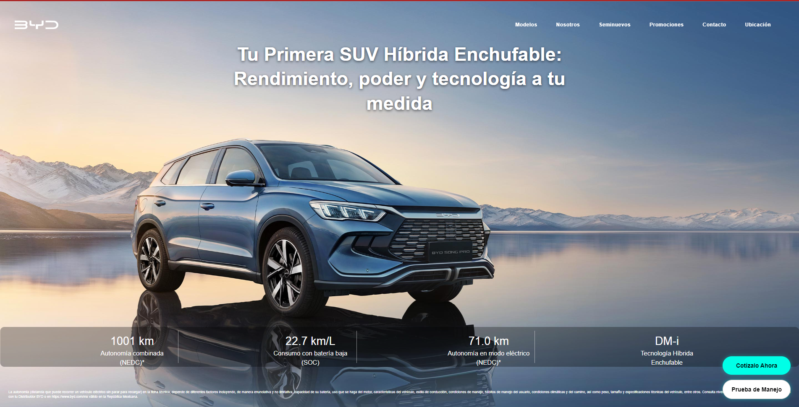

# Mario Gonzalez Aceves
### Software Engineer | FullStack Developer

  
  
  

---

### Perfil Profesional
Ingeniero en Sistemas Computacionales enfocado en el desarrollo de soluciones escalables que optimizan procesos de negocio. Mi trayectoria combina la precisión de la digitalización industrial con la agilidad de los ecosistemas comerciales digitales.

---

### Experiencia Relevante

#### **Grupo Fame** | FullStack Developer Jr | Mayo 2025 — Actualidad
* Desarrollo Web Comercial: Creación y mantenimiento de plataformas informativas de alto rendimiento para agencias automotrices.
* Integraciones & APIs: Implementación de flujos de datos mediante Meta API y conexiones directas a CRM y Jotform.
* Sistemas Internos: Desarrollo de CRUDs para gestión de proveedores y herramientas de administración interna.
* Visión de Negocio: Experiencia complementaria en análisis de KPIs, presupuestos y campañas de Google Ads (enfoque estratégico).

#### **Continental AG** | Intern / Developer | Septiembre 2024 — Abril 2025
* Digitalización Industrial: Desarrollo de un sistema web interno para la transición de checklists manuales a digitales.
* Data Visualization: Implementación de módulos de graficación de resultados para el monitoreo del estado de maquinaria pesada en tiempo real.

---

### Portafolio de Proyectos (Producción)

| BYD Juriquilla | Honda Morelia |
| :---: | :---: |
|  |  |
| [Visitar Sitio](https://bydjuriquilla.com) | [Visitar Sitio](https://hondamorelia.com) |

| Fame Valladolid | Continental AG System |
| :---: | :---: |
|  |  |
| [Visitar Sitio](https://famevalladolid.com) | *Sistema Interno de Datos* |

---

### Stack Tecnológico

| Área | Tecnologías |
| :--- | :--- |
| Frontend | JS Vanilla, React JS, HTML5, CSS3 |
| Backend | PHP Vanilla, Laravel, MySQL |
| Herramientas & Cloud | Firebase, Meta API, AWS (En proceso de aprendizaje) |
| Integraciones | CRM, Jotform, Google Ads (Estratégico) |

---

### Enfoque Actual
Actualmente estoy profundizando mis conocimientos en Arquitectura Cloud (AWS) para llevar el despliegue de aplicaciones a un nivel de infraestructura corporativa, buscando siempre la transición de lo comercial hacia la ingeniería de software pura.

---

### Conectemos

---

  <i>"Transformando la complejidad técnica en eficiencia operativa."</i>

